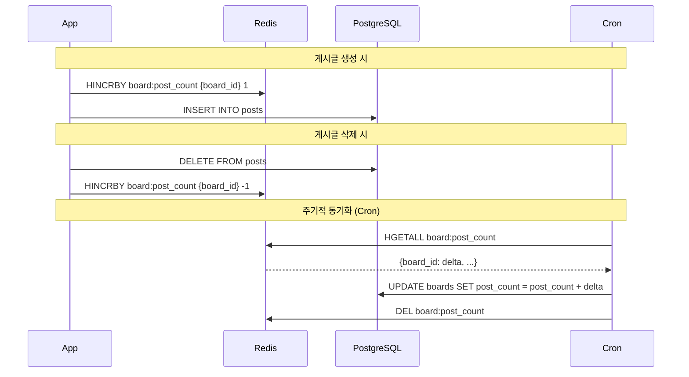

# Redis 캐싱 전략

## 개요

게시판 목록을 게시글 수 순으로 정렬하기 위해 Redis를 활용한 비동기 캐싱 시스템을 구현했습니다. 실시간성보다 성능을 우선시하여 배치 처리 방식을 채택했습니다.

## 문제 상황

### 기존 방식의 문제점
```sql
-- 매번 JOIN과 COUNT 연산 필요
SELECT boards.*, COUNT(posts.id) as post_count
FROM boards 
LEFT JOIN posts ON boards.id = posts.board_id
WHERE (boards.public = true OR boards.owner_id = ?)
GROUP BY boards.id
ORDER BY post_count DESC;
```

- 게시판 조회 시마다 JOIN 및 COUNT 연산
- 게시글이 많을수록 성능 저하
- 게시판 목록 조회 빈도가 높음

## 해결 방안

### Redis Hash를 활용한 증감량 추적



## 구현 상세

### Redis 데이터 구조

```
Key: board:post_count
Type: Hash
Structure:
  "1" -> "5"     # board_id 1의 증감량: +5
  "2" -> "-2"    # board_id 2의 증감량: -2
  "3" -> "1"     # board_id 3의 증감량: +1
```

### 핵심 메소드

```python
# 증감량 기록
def increment_post_count_delta(self, board_id: int):
    redis_client.hincrby("board:post_count", str(board_id), 1)

def decrement_post_count_delta(self, board_id: int):
    redis_client.hincrby("board:post_count", str(board_id), -1)

# 배치 동기화
def update_board_post_counts(self, db: Session):
    deltas = redis_client.hgetall("board:post_count")
    for board_id, delta in deltas.items():
        # DB 업데이트
        board.post_count = max(0, board.post_count + int(delta))
    redis_client.delete("board:post_count")
```

## 성능 최적화 효과

### Before (실시간 계산)
```sql
-- O(N * M) 복잡도 (N: 게시판 수, M: 게시글 수)
SELECT boards.*, COUNT(posts.id) as post_count
FROM boards LEFT JOIN posts ON boards.id = posts.board_id
GROUP BY boards.id ORDER BY post_count DESC;
```

### After (캐시된 값 사용)
```sql
-- O(N) 복잡도 (N: 게시판 수)
SELECT * FROM boards 
ORDER BY post_count DESC, id ASC;
```

## 데이터 일관성 관리

### 장점
- 게시판 조회 성능 대폭 향상 (JOIN 제거)
- Redis 메모리 사용량 최소화 (단일 Hash 키)
- 배치 처리로 DB 부하 분산

### 트레이드오프
- 게시글 수 정렬이 약간의 지연 (최대 cron 주기만큼)
- Redis 장애 시 증감량 손실 가능성

### 복구 전략
```python
# 관리 명령어로 실제 게시글 수와 동기화
def init_post_count():
    for board in boards:
        actual_count = db.query(Post).filter(Post.board_id == board.id).count()
        board.post_count = actual_count
```

## 배치 작업 연동 (미구현)

추후 Airflow 또는 Cron Job으로 주기적 동기화 예정