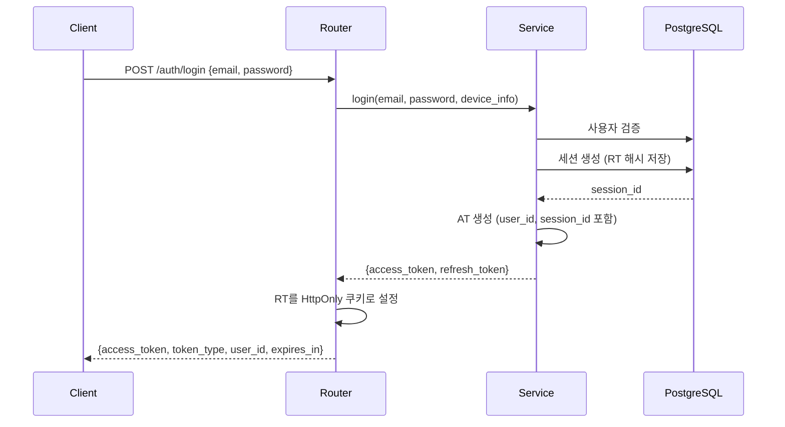
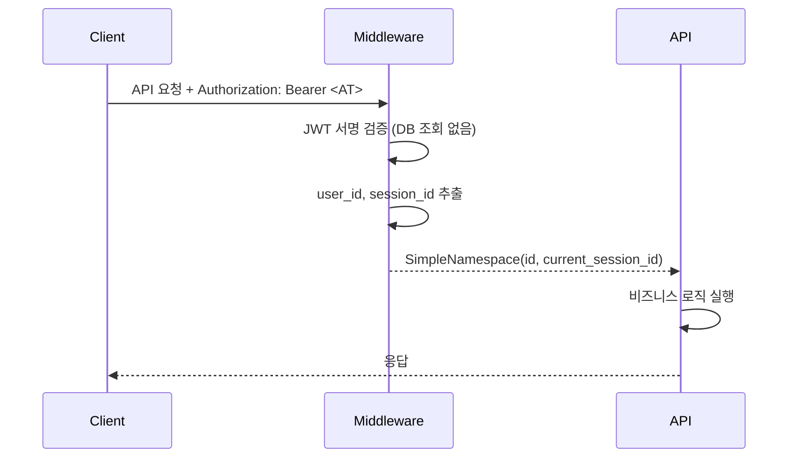
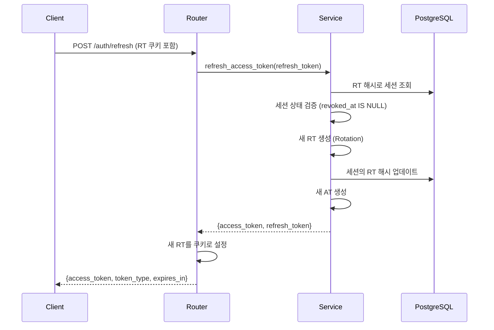
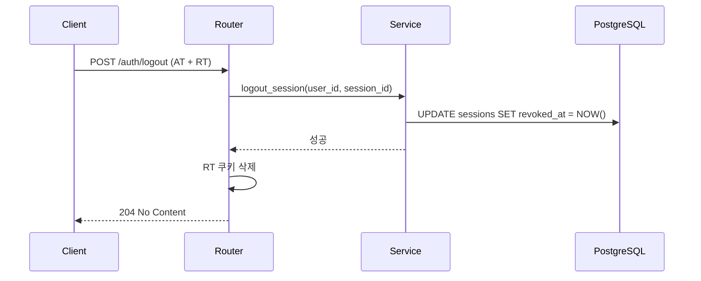

# 하이브리드 JWT 인증 구현

## 개요

하이브리드 JWT 패턴을 도입해 확장성과 보안성을 함께 확보했습니다. stateless한 Access Token의 성능 이점과 stateful한 Refresh Token의 보안 이점을 결합한 방식으로, 대규모 서비스에서 널리 쓰입니다.

## 기존 방식의 문제점

### 순수 JWT (완전 stateless)
- **문제**: 즉시 토큰 무효화 불가능
- **보안 위험**: 토큰 탈취 시 만료까지 사용 가능
- **사용자 경험**: 강제 로그아웃 지연

### 세션 기반 (완전 stateful)
- **문제**: 매 요청마다 DB/Redis 조회
- **성능**: 확장성 제한
- **복잡성**: 분산 환경에서 세션 동기화 필요

## 하이브리드 패턴 설계

### Access Token (AT) - Stateless
```
수명: 5분 (300초)
저장: 클라이언트 (Authorization 헤더)
검증: JWT 서명만 확인 (DB 조회 없음)
클레임: { "sub": user_id, "sid": session_id, "exp": expiry }
```

### Refresh Token (RT) - Stateful
```
수명: 30일 (2,592,000초)
저장: HttpOnly 쿠키 (XSS 방지)
검증: DB 조회 + 세션 상태 확인
보안: SHA256 해시 저장, Rotation 적용
```

## 인증 플로우

### 1. 로그인 (POST /auth/login)



### 2. API 요청 (Protected Endpoints)



### 3. 토큰 갱신 (POST /auth/refresh)



### 4. 로그아웃 (POST /auth/logout)



## 보안 특징

### RT Rotation
- 매 갱신마다 새로운 RT 발급
- 기존 RT 즉시 무효화
- 재사용 공격 (Replay Attack) 방지

### 점진적 로그아웃
- 로그아웃 시 RT만 즉시 무효화
- 기존 AT는 5분 후 자연 만료
- 새로운 AT 발급 차단으로 실질적 로그아웃 효과

### 다중 기기 관리
```sql
-- 각 기기별 독립적인 세션
sessions 테이블:
- device_name: 자동 파싱된 기기명
- ip_address: 접속 IP 추적
- user_agent: 브라우저/앱 정보
- last_seen_at: 마지막 활동 시간
```

## 데이터베이스 설계

### Sessions 테이블
```sql
CREATE TABLE sessions (
    id UUID PRIMARY KEY DEFAULT uuid_generate_v4(),
    user_id INTEGER NOT NULL REFERENCES users(id) ON DELETE CASCADE,
    device_name VARCHAR(255),
    ip_address VARCHAR(45),  -- IPv6 지원
    user_agent TEXT,
    refresh_token_hash VARCHAR(255) UNIQUE NOT NULL,
    created_at TIMESTAMP WITH TIME ZONE DEFAULT NOW(),
    last_seen_at TIMESTAMP WITH TIME ZONE DEFAULT NOW(),
    expires_at TIMESTAMP WITH TIME ZONE NOT NULL,
    revoked_at TIMESTAMP WITH TIME ZONE,  -- NULL = 활성
    revocation_reason VARCHAR(100)
);

-- 성능 최적화 인덱스 (SQLAlchemy로 자동 생성)
-- PRIMARY KEY: id (자동)
-- UNIQUE: refresh_token_hash (자동)  
-- INDEX: user_id (FK 조회용)
-- INDEX: expires_at (세션 정리/통계용)
-- INDEX: revoked_at (감사/관리용)
```

## API 엔드포인트

### 인증 관련
| 메소드 | 경로 | 설명 | 요청 | 응답 |
|--------|------|------|------|------|
| POST | `/auth/signup` | 회원가입 | SignupRequest | SignupResponse |
| POST | `/auth/login` | 로그인 | LoginRequest | LoginResponse + RT 쿠키 |
| POST | `/auth/refresh` | 토큰 갱신 | RT 쿠키 | RefreshResponse + 새 RT 쿠키 |
| POST | `/auth/logout` | 현재 세션 로그아웃 | AT + RT | 204 + 쿠키 삭제 |
| GET | `/auth/sessions` | 활성 세션 목록 | AT | UserSessionsResponse |
| DELETE | `/auth/sessions` | 모든 세션 로그아웃 | AT + RT | 204 + 쿠키 삭제 |
| DELETE | `/auth/sessions/{id}` | 특정 세션 로그아웃 | AT | 204 |

### 응답 예시

#### 로그인 성공
```json
{
  "access_token": "eyJhbGciOiJIUzI1NiIsInR5cCI6IkpXVCJ9...",
  "token_type": "bearer",
  "user_id": 123,
  "expires_in": 300
}
```

#### 활성 세션 목록
```json
{
  "sessions": [
    {
      "session_id": "550e8400-e29b-41d4-a716-446655440000",
      "device_name": "Chrome on Windows",
      "last_active": "2025-09-15T10:30:00Z",
      "ip_address": "192.168.1.100"
    }
  ]
}
```

## 구현 핵심 코드

### JWT 토큰 생성
```python
def create_access_token(data: dict, expires_delta: Optional[timedelta] = None):
    to_encode = data.copy()
    if expires_delta:
        expire = datetime.utcnow() + expires_delta
    else:
        expire = datetime.utcnow() + timedelta(seconds=ACCESS_TOKEN_EXPIRE_SECONDS)
    
    to_encode.update({"exp": expire})
    encoded_jwt = jwt.encode(to_encode, SECRET_KEY, algorithm=ALGORITHM)
    return encoded_jwt

# 사용 예시
access_token = create_access_token({
    "sub": str(user.id),
    "sid": str(session_id)
})
```

### Stateless 인증 미들웨어
```python
def get_current_user(credentials: HTTPAuthorizationCredentials = Depends(security)):
    """하이브리드 패턴: AT는 완전 stateless"""
    token = credentials.credentials
    payload = verify_access_token(token)  # JWT 서명만 검증
    user_id = payload["user_id"]
    session_id = payload.get("session_id")
    
    return SimpleNamespace(
        id=user_id,
        current_session_id=session_id
    )
```

### RT Rotation 구현
```python
def refresh_access_token(self, db: Session, refresh_token: str):
    # 1. RT 검증 및 세션 조회
    session = session_repository.get_device_session(db, refresh_token)
    if not session or session.revoked_at:
        raise HTTPException(status_code=401, detail="Invalid token")
    
    # 2. 새 RT 생성 및 기존 RT 무효화 (Rolling Expiry)
    new_refresh_token = create_refresh_token()
    session_repository.update_refresh_token(db, str(session.id), new_refresh_token)
    # → expires_at도 30일 연장됨
    
    # 3. 새 AT 발급
    access_token = create_access_token({
        "sub": str(session.user_id),
        "sid": str(session.id)
    })
    
    return {
        "access_token": access_token,
        "refresh_token": new_refresh_token,
        "expires_in": ACCESS_TOKEN_EXPIRE_SECONDS
    }
```

## 설정 상수

```python
# lib/auth.py
ACCESS_TOKEN_EXPIRE_SECONDS = 5 * 60           # 5분
REFRESH_TOKEN_EXPIRE_SECONDS = 30 * 24 * 60 * 60  # 30일
SECRET_KEY = os.getenv("SECRET_KEY", "...")
ALGORITHM = "HS256"
```

## 장점 및 효과

### 성능
- **무상태 검증**: 매 API 요청 시 DB 조회 없음
- **확장성**: 마이크로서비스 환경에 적합
- **캐시 친화적**: AT는 완전 자체 포함적

### 보안
- **RT Rotation**: 토큰 재사용 공격 방지
- **HttpOnly 쿠키**: XSS 공격으로부터 RT 보호
- **점진적 로그아웃**: 보안과 사용자 경험 균형
- **세션 추적**: 의심스러운 활동 모니터링 가능

### 운영
- **다중 기기 지원**: 기기별 독립적 세션 관리
- **강제 로그아웃**: 관리자가 특정 사용자/세션 차단 가능
- **감사 추적**: 세션 생성/만료/로그아웃 기록

## 모니터링 포인트

### 보안 메트릭
- RT 갱신 실패율 (탈취 탐지)
- 동일 사용자의 다중 위치 로그인
- 짧은 시간 내 다중 기기 등록

### 성능 메트릭
- AT 검증 시간 (JWT 파싱 성능)
- RT 갱신 응답 시간 (DB 쿼리 성능)
- 세션 DB 크기 증가율
