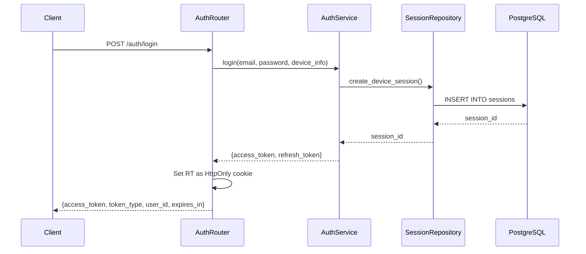
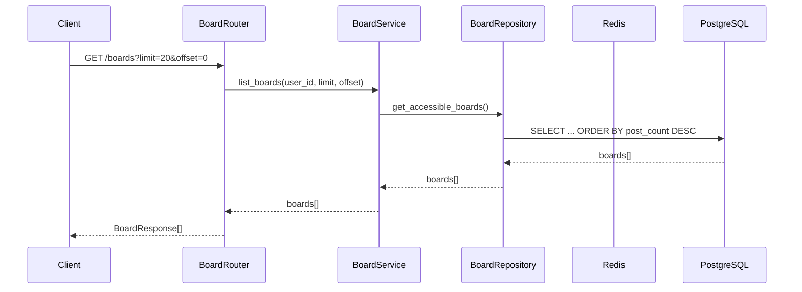
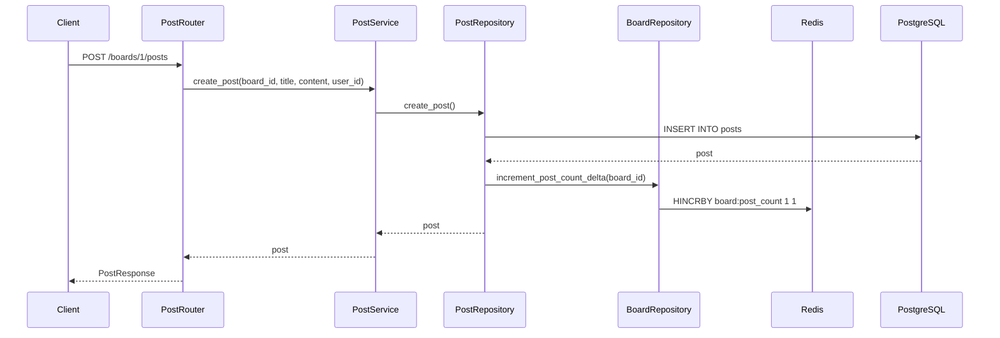
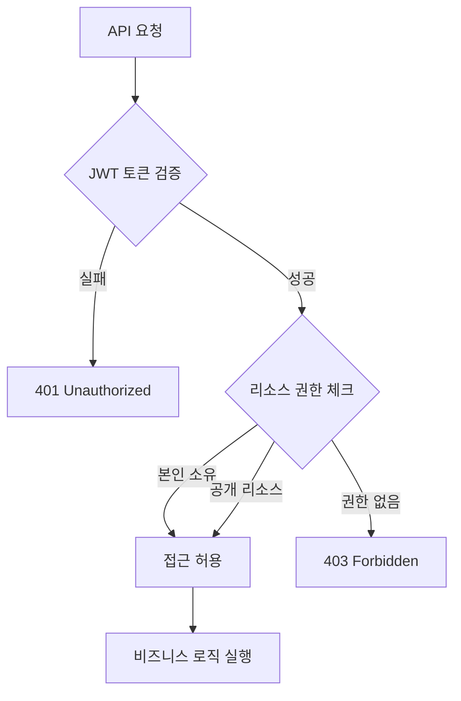

# API 설계

## RESTful API 설계 원칙

### 리소스 기반 URL 구조
```
/auth          - 인증 관련
/boards        - 게시판 리소스
/boards/{id}/posts - 게시판별 게시글 리소스
```

### HTTP 메소드 매핑
- `GET`: 리소스 조회
- `POST`: 리소스 생성
- `PUT`: 리소스 전체 수정
- `DELETE`: 리소스 삭제

## API 엔드포인트

### 인증 API (/auth)



#### 엔드포인트 목록
| 메소드 | 경로 | 설명 | 요청 스키마 | 응답 스키마 |
|--------|------|------|-------------|-------------|
| POST | `/auth/signup` | 회원가입 | SignupRequest | SignupResponse |
| POST | `/auth/login` | 로그인 | LoginRequest | LoginResponse |
| POST | `/auth/refresh` | 토큰 갱신 | Cookie(RT) | RefreshResponse |
| POST | `/auth/logout` | 현재 세션 로그아웃 | - | 204 No Content |
| GET | `/auth/sessions` | 활성 세션 목록 | - | UserSessionsResponse |
| DELETE | `/auth/sessions` | 모든 세션 로그아웃 | - | 204 No Content |
| DELETE | `/auth/sessions/{id}` | 특정 세션 로그아웃 | - | 204 No Content |

### 커뮤니티 게시판 API (/boards)



#### 엔드포인트 목록
| 메소드 | 경로 | 설명 | 요청 스키마 | 응답 스키마 |
|--------|------|------|-------------|-------------|
| POST | `/boards` | 게시판 생성 | BoardCreateRequest | BoardResponse |
| GET | `/boards` | 게시판 목록 조회 | Query params | BoardResponse[] |
| GET | `/boards/{id}` | 게시판 상세 조회 | - | BoardResponse |
| PUT | `/boards/{id}` | 게시판 수정 | BoardUpdateRequest | BoardResponse |
| DELETE | `/boards/{id}` | 게시판 삭제 | - | 204 No Content |

### 커뮤니티 게시글 API



#### 엔드포인트 목록
| 메소드 | 경로 | 설명 | 요청 스키마 | 응답 스키마 |
|--------|------|------|-------------|-------------|
| POST | `/boards/{board_id}/posts` | 게시글 생성 | PostCreateRequest | PostResponse |
| GET | `/boards/{board_id}/posts` | 게시글 목록 조회 | Query params | PostListResponse |
| GET | `/posts/{post_id}` | 게시글 상세 조회 | - | PostResponse |
| PUT | `/posts/{post_id}` | 게시글 수정 | PostUpdateRequest | PostResponse |
| DELETE | `/posts/{post_id}` | 게시글 삭제 | - | 204 No Content |

## 공통 응답 구조

### 성공 응답
```json
{
  "data": { ... },
  "message": "Success"
}
```

### 에러 응답
```json
{
  "detail": "Error message",
  "status_code": 400
}
```

## 권한 체크 흐름



## 페이지네이션

### 게시판 목록
- **방식**: Offset 기반
- **정렬**: `post_count DESC, id ASC`
- **파라미터**: `limit`, `offset`

### 게시글 목록
- **방식**: Cursor 기반 (시간 + ID)
- **정렬**: `created_at DESC, id DESC`
- **파라미터**: `cursor_time`, `cursor_id`, `limit`