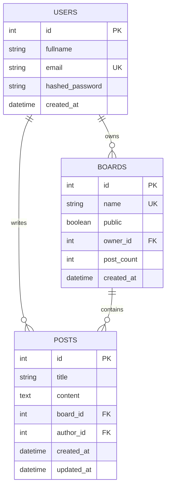

# 데이터베이스 설계

## ERD (Entity Relationship Diagram)



## 테이블 상세 설계

### users 테이블
| 컬럼명 | 타입 | 제약조건 | 설명 |
|--------|------|----------|------|
| id | INTEGER | PK, AUTO_INCREMENT | 사용자 고유 ID |
| fullname | VARCHAR(100) | NOT NULL | 사용자 이름 |
| email | VARCHAR(255) | UNIQUE, NOT NULL | 로그인용 이메일 |
| hashed_password | VARCHAR(255) | NOT NULL | 암호화된 비밀번호 |
| created_at | TIMESTAMP | DEFAULT NOW() | 계정 생성일 |

### boards 테이블
| 컬럼명 | 타입 | 제약조건 | 설명 |
|--------|------|----------|------|
| id | INTEGER | PK, AUTO_INCREMENT | 게시판 고유 ID |
| name | VARCHAR(100) | UNIQUE, NOT NULL | 게시판 이름 |
| public | BOOLEAN | DEFAULT TRUE | 공개 여부 |
| owner_id | INTEGER | FK(users.id), NOT NULL | 소유자 ID |
| post_count | INTEGER | DEFAULT 0 | 게시글 수 캐시 |
| created_at | TIMESTAMP | DEFAULT NOW() | 게시판 생성일 |

### posts 테이블
| 컬럼명 | 타입 | 제약조건 | 설명 |
|--------|------|----------|------|
| id | INTEGER | PK, AUTO_INCREMENT | 게시글 고유 ID |
| title | VARCHAR(200) | NOT NULL | 게시글 제목 |
| content | TEXT | NOT NULL | 게시글 내용 |
| board_id | INTEGER | FK(boards.id), NOT NULL | 소속 게시판 ID |
| author_id | INTEGER | FK(users.id), NOT NULL | 작성자 ID |
| created_at | TIMESTAMP | DEFAULT NOW() | 게시글 생성일 |
| updated_at | TIMESTAMP | ON UPDATE NOW() | 게시글 수정일 |

## 인덱스 설계

### 성능 최적화를 위한 인덱스
```sql
-- 공개 게시판 정렬용 (UNION ALL 최적화)
CREATE INDEX idx_boards_public_rank ON boards (public, post_count DESC, id)
WHERE public = true;

-- 내 게시판 정렬용 (UNION ALL 최적화)  
CREATE INDEX idx_boards_owner_rank ON boards (owner_id, post_count DESC, id);

-- 게시글 목록 조회 (board별 시간 내림차순)
CREATE INDEX idx_posts_board_created ON posts (board_id, created_at DESC, id DESC);

-- 권한 체크용 인덱스
CREATE INDEX idx_posts_author ON posts (author_id);

-- 고유 제약조건
CREATE UNIQUE INDEX idx_users_email ON users (email);
CREATE UNIQUE INDEX idx_boards_name ON boards (name);
```

## 데이터 무결성

### 외래키 제약조건
- `boards.owner_id` → `users.id` (RESTRICT DELETE)
- `posts.board_id` → `boards.id` (CASCADE DELETE)
- `posts.author_id` → `users.id` (RESTRICT DELETE)

### 비즈니스 규칙
- 게시판 이름은 전역 고유
- 사용자 이메일은 전역 고유
- 게시판 삭제 시 모든 게시글 함께 삭제
- 사용자 삭제 시 소유한 게시판이 있으면 삭제 불가
- 사용자 삭제 시 작성한 게시글이 있으면 삭제 불가

## Redis 데이터 구조

### 세션 관리
```
Key: session:{user_id}
Type: String
Value: {access_token}
TTL: ACCESS_TOKEN_EXPIRE_MINUTES (기본 30분)
```

### 게시글 수 증감량 캐시
```
Key: board:post_count
Type: Hash
Fields: 
  - {board_id}: {delta_count}
TTL: 없음 (배치작업으로 정리)
```