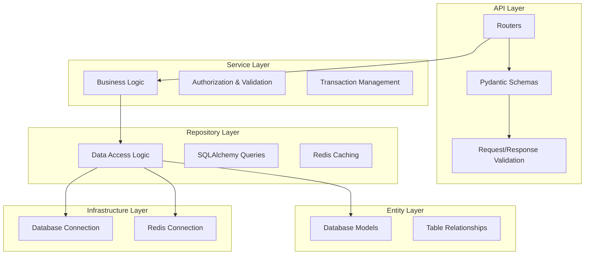

# 아키텍처 개요

## 전체 시스템 구조

## 레이어별 역할

### 1. API Layer (routers/ + schemas/)
- **Routers**: HTTP 요청/응답 처리
- **Pydantic Schemas**: 요청 데이터 검증 및 응답 직렬화
- 인증/권한 검증
- Service Layer 호출

### 2. Service Layer (services/)
- 비즈니스 로직 구현
- 권한 체크 및 예외 처리
- Repository Layer 호출
- 트랜잭션 관리

### 3. Repository Layer (repositories/)
- 데이터 접근 로직
- SQLAlchemy ORM 쿼리
- Redis 캐싱 로직 (게시글 카운트 등)
- 세션 관리 (PostgreSQL 기반)
- 데이터 변환

### 4. Entity Layer (entities/)
- 데이터베이스 테이블 모델 정의
- 테이블 관계 설정
- SQLAlchemy Base 상속

### 5. Infrastructure Layer (infra/)
- 외부 의존성 관리
- 데이터베이스 연결 (PostgreSQL)
- 캐시 연결 (Redis)

## 주요 설계 원칙

### Clean Architecture
- 의존성은 항상 안쪽 레이어를 향함
- 비즈니스 로직은 Service Layer에 집중
- 외부 의존성은 Infrastructure Layer에서 관리

### Repository Pattern
- 데이터 접근 로직을 캡슐화
- 테스트 가능성 향상
- 데이터 소스 변경 시 유연성 확보

### Dependency Injection
- FastAPI의 Depends를 활용
- 느슨한 결합도 유지
- 테스트 시 Mock 객체 주입 용이

## 기술 스택

- **Framework**: FastAPI (비동기 지원, 자동 문서화)
- **ORM**: SQLAlchemy (강력한 쿼리 기능)
- **Database**: PostgreSQL (ACID 보장)
- **Cache**: Redis (게시글 카운트 최적화)
- **Authentication**: Hybrid JWT Pattern (stateless AT + stateful RT via PostgreSQL)
- **CLI**: Typer (관리 명령어)